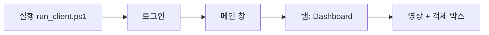
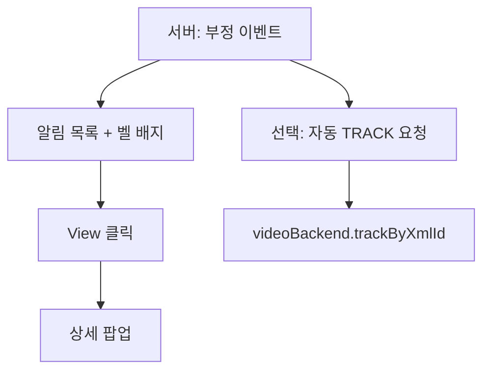
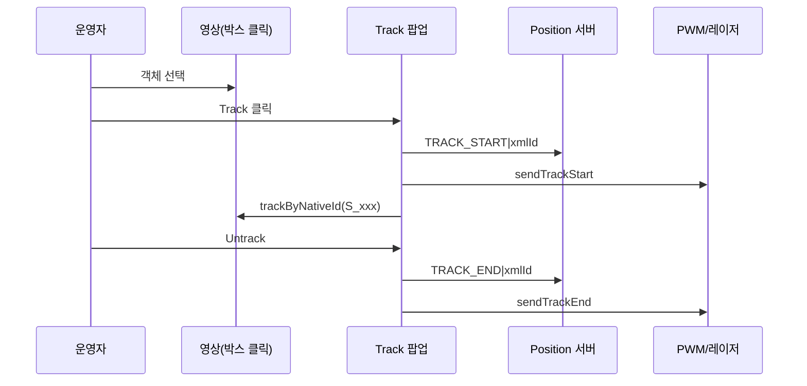

# SFEPS Qt 클라이언트 사용 도움말

**화면에서 무엇을 눌러야 하는지**는 **§4 사용 플로우** 를 먼저 보세요.

이 문서는 저장소의 **`Client/`** (Qt 6 / QML 관제 클라이언트) 기준으로, **기능 개요**, **단계별 사용 절차**, **주요 조작**, **환경 변수**, **빌드·실행**을 정리합니다.  
상세 빌드 절차는 `Client/README.md`, `Client/MSVC_BUILD_GUIDE.md`, PWM 하드웨어 연동은 `Client/RASPI_PWM_SETUP.md`를 참고하세요.

---

## 1. 애플리케이션 개요

| 구분 | 설명 |
|------|------|
| 실행 파일 | `appHanwhaVisionSFEPS.exe` (Windows MSVC 빌드) |
| UI | Qt Quick (`Main.qml`, `src/views/*.qml`, `VideoDisplay.qml`) |
| 백엔드 C++ | `Client/src/*.cpp` — 인증, 부정승차 알림, 음성, 위치/트래킹, PWM 송신, 아카이브 등 |
| 선택 기능 | OpenCV (`SFEPS_HAVE_OPENCV`): 저지연 RTSP 프리뷰, ONVIF 메타데이터 기반 박스, `camera_RBF` Qt 모드 시 RBF/PWM·포즈 추정 |

---

## 2. 시작 화면과 동작 모드

### 2.1 일반 모드 (기본)

1. **`LoginView.qml`** — ID/PW 로그인 (`AuthManager`).
2. 성공 시 **`Main.qml`** 로 전환 (창 제목: `Hanwha Vision SFEPS`).
3. 로그인 후 **Fraud 알림 채널** 연결, 서버 `TEST|LOGIN_OK` 확인 뒤 **Position 서버** 연결.

### 2.2 직접 스트림 모드 (`SFEPS_DIRECT_STREAM_MODE=1`)

- 로그인·Fraud·Position 서버 접속을 **건너뛰고** 바로 `Main.qml` 로드.
- RTSP 모니터링·UI 테스트용. 운영 환경에서는 권장하지 않음.

---

## 3. 메인 화면 구성 (`Main.qml`)

| 인덱스 | 화면 | QML 파일 | 요약 |
|--------|------|----------|------|
| 1 | 라이브 모니터링 | `views/MonitoringView.qml` | 실시간 영상, 객체 박스, 부정승차 알림, 마이크·레이저 추적 등 |
| 2 | 분석 | `views/AnalyticsView.qml` | 세션/통계 요약 |
| 3 | 설정 | `views/SettingsView.qml` | 앱 설정 |
| 기타 | 로그인 | `views/LoginView.qml` | 인증 |
| 기타 | 아카이브 | `views/ArchiveView.qml` | 녹화 목록·재생 (`VideoArchiveManager`) |
| 기타 | 상세 팝업 | `views/DetailView.qml` | 알림 상세 |

전역 속성 예: `laserTrackingEnabled` — 레이저 추적 ON/OFF (PWM·포즈 계산 게이트와 연동).

---

## 4. 사용 플로우 (운영자가 화면에서 따라 할 일)

아래는 **실제 QML 동작**(`Main.qml`, `MonitoringView.qml`, `SettingsView.qml` 등)에 맞춘 순서입니다.  
(OpenCV·`CAMERA_RBF_QT_MODE` 빌드가 아니면 레이저/트랙 일부 버튼이 동작하지 않거나 박스만 표시될 수 있습니다.)

### 4.1 처음 실행 ~ 라이브 화면까지

1. **`run_client.ps1`**(또는 `run_client.cmd`)으로 실행해 서버 주소·RTSP·CA 등을 맞춥니다. (`Client/README.md` 참고)
2. **로그인 창**에서 ID·PW 입력 후 로그인.
3. **메인 창**이 뜨면 상단 탭에서 **Dashboard**가 선택된 상태인지 확인합니다. (라이브 모니터링 = `MonitoringView`)

### 4.2 대시보드에서 하는 일 (영상·그림)

| 하고 싶은 일 | 화면에서 하는 일 |
|--------------|------------------|
| 스트림 확인 | 상단 상태가 **ONLINE** 근처로 연결되면 메타데이터/영상 수신 중입니다. |
| 밝기·대비 조절 | 비디오 옆 **Brightness / Contrast** 슬라이더 (Hanwha CGI URL·계정은 환경 변수) |
| 지연 확인 | 모니터링 화면에 표시되는 **스트림 지연(ms)** 등을 참고 (구현에 따라 표시) |

### 4.3 부정승차 알림이 왔을 때

1. 우측 상단 **알림(벨)** 아이콘을 누릅니다.
2. 목록에서 이벤트를 고르고 **View** → **상세 팝업**에서 객체 ID·카드 정보 등을 확인합니다.
3. 서버가 부정으로 판정한 객체는 **빨간 박스(fraud)** 로 강조될 수 있습니다.
4. 서버가 **자동 추적**을 보내면, 별도로 Track을 누르지 않아도 `trackByXmlId` 가 호출되어 **레이저 자동 추적**이 시작될 수 있습니다. (백엔드 `fraudAutoTrackRequest` 연동)

### 4.4 수동으로 레이저 추적 (Track / Untrack)

**전제:** 설정에서 **Laser Tracking** 이 켜져 있고, 빌드에 OpenCV + RBF Qt 모드가 포함된 경우.

1. **Dashboard**에서 영상 위 **객체 박스를 클릭**해 선택합니다. (선택 ID가 생기면 Track 팝업 조건 충족)
2. **Track** 팝업에서 상태 문구(`Tracking: ...`)를 확인합니다.
3. **Track** 버튼 클릭 시:
   - Position 채널로 `TRACK_START|<xmlId>` 전송
   - `pwmTransmitter.sendTrackStart` 로 하드웨어 측 추적 시작 통지
   - `videoBackend.trackByNativeId`(stable **S_xxx** ID)로 트래킹 고정
4. 추적을 멈출 때는 같은 팝업의 **Untrack**(또는 구현상 **Track 해제** 버튼)으로 종료합니다.  
   → `TRACK_END`, `clearRbfTarget`, PWM 종료 신호가 나갑니다.

### 4.5 레이저 기능만 잠시 끄기

- **System Settings** 탭 → **Laser Tracking** 스위치 **OFF**  
  → 즉시 `setLaserTrackingEnabled(false)` 가 호출되어 **PWM·포즈 기반 조준 계산**이 멈추고, 필요 시 진행 중 추적도 정리됩니다.

### 4.6 관리자 음성(마이크 → 서버 스피커)

1. Dashboard 우측(또는 도구 모음)의 **마이크** 버튼을 누릅니다. (켜짐: `voiceManager.active`)
2. 말한 내용이 **16 kHz RAW PCM**으로 오디오 서버로 전송됩니다.
3. 다시 버튼을 눌러 **전송 종료**합니다.  
   - 호스트/포트/TLS는 아래 **§7.3 알림·위치·음성** 표를 참고하세요.

### 4.7 분석 화면·녹화 아카이브

1. 상단 탭 **Analytics** 로 이동합니다.
2. 세션 통계 카드 등을 확인합니다.
3. 아래쪽 **Video Storage** 영역에 **ArchiveView** 가 로드되어 **녹화 목록·재생**을 할 수 있습니다. (비디오 카탈로그 서버·`VIDEO_CATALOG_HOST` 필요)

### 4.8 로그인 없이 영상만 보기 (개발/시연)

- 환경 변수 **`SFEPS_DIRECT_STREAM_MODE=1`** 로 실행하면 로그인·Fraud·Position 연결 없이 **메인 화면만** 뜹니다. 운영 배포에는 사용하지 마세요.

---

## 5. QML에서 쓰는 백엔드 객체 (`main.cpp` 등록)

| 컨텍스트 속성 | 클래스 | 역할 |
|---------------|--------|------|
| `authManager` | `AuthManager` | 로그인/로그아웃, TLS, 강제 로그아웃 알림 |
| `voiceManager` | `VoiceManager` | 마이크 ON 시 **RAW PCM**을 오디오 서버로 스트리밍 |
| `fraudManager` | `FraudManager` | 부정승차 알림 수신, 자동 추적 요청, 알림 목록 연동 |
| `positionManager` | `PositionManager` | Position 채널(TCP/TLS): `SET_PWM`, `TRACK_END`, `SUB_POS` 등 |
| `pwmTransmitter` | `PwmTransmitter` | RBF PWM을 **라즈베리 TCP** 및/또는 **ESP8266 UDP/TCP**로 전송 |
| `videoBackend` | `MainWindow` | ONVIF 메타데이터 스레드, (OpenCV 시) RTSP 캡처·박스·RBF Qt 모드 |
| `videoArchiveManager` | `VideoArchiveManager` | 비디오 카탈로그 서버 연동 |
| `recordingListModel` | `RecordingListModel` | 녹화 목록 모델 |
| `rtspStreamUrl` | 문자열 | QML `MediaPlayer`용 RTSP URL |
| `rtspMediaProbeSize` | 정수 | FFmpeg probe 크기(지연 튜닝) |

OpenCV 빌드 시 `live` 이미지 프로바이더로 **라이브 프리뷰** 프레임 제공.

---

## 6. 기능별 사용 요약

### 6.1 로그인·보안 (`AuthManager`)

- 환경 변수로 **호스트·포트·TLS·CA** 설정 (아래 **§7 환경 변수 요약** 참고).
- 서버와 연결이 끊기면 타이머 후 **강제 로그아웃** 안내 가능.
- 서버에서 `AUTH|FORCE_LOGOUT` 수신 시 즉시 로그아웃 처리.

### 6.2 실시간 모니터링 (`MonitoringView` + `videoBackend`)

- **스트림**: `RTSP_STREAM_URL` 기준. OpenCV 경로는 `RTSP_STREAM_URL`, `SFEPS_GSTREAMER_PIPELINE` 등으로 저지연 튜닝.
- **ONVIF 메타데이터**: `SFEPS_USE_ONVIF_METADATA` (기본 true) — 객체 bbox·ID 수신.
- OpenCV + **`CAMERA_RBF_QT_MODE` 빌드** 시:
  - `rbfqt_process_metadata` / `rbfqt_compute_pwm` 으로 트래킹·PWM 계산.
  - `videoBackend.setLaserTrackingEnabled(true/false)` — 레이저 추적 토글 시에만 PWM·포즈 파이프라인 동작.
- **카메라 CGI**: Brightness/Contrast 슬라이더 — Hanwha CGI URL·계정은 환경 변수로 지정.

### 6.3 부정승차 알림 (`FraudManager` + `videoBackend`)

- 서버에서 오는 이벤트로 **알림 목록** 갱신.
- 부정(`isFraud`)이면 `videoBackend.addFraudXmlId(objectId)` 로 해당 **XML ID** 박스를 빨간색 등으로 표시.
- `fraudAutoTrackRequest` 수신 시 `trackByXmlId(xmlId, fallbackLTRB...)` 로 **자동 레이저 추적** 시작 가능.
- 추적 종료 시 `TRACK_END` 를 Position/PWM 경로로 통지 (`CAMERA_RBF_QT_MODE` 빌드 시).

### 6.4 음성 (관리자 → 서버 방송 수신 경로와 별개로 **클라이언트 송신**)

- `VoiceManager`: 마이크 버튼으로 **16 kHz, mono, S16 LE** RAW PCM을 서버로 전송.
- 호스트: `AUDIO_SERVER_HOST` 또는 미설정 시 `FRAUD_SERVER_HOST` / 코드 기본값.
- 포트: 일반 `AUDIO_SERVER_PORT` (기본 5556), TLS 시 `SFEPS_AUDIO_TLS_PORT` (기본 6556).
- TLS 실패 시 일정 시간 후 **평문 폴백** 로직 있음.

### 6.5 위치·PWM (`PositionManager` + `PwmTransmitter`)

- **Position 서버** (`POS_SERVER_HOST`, 포트 5558 또는 TLS 6558): 모니터링·로깅용으로 `SET_PWM,PAN=...,TILT=...` 등 전송.
- **PWM 하드웨어** (`PwmTransmitter`):
  - `SFEPS_PWM_MODE`: `raspi` | `stm` | `both`
  - 라즈베리: `SFEPS_PWM_HOST`, `SFEPS_PWM_PORT` (기본 5566)
  - STM/ESP: `SFEPS_PWM_STM_HOST`, `SFEPS_PWM_STM_PORT`, `SFEPS_PWM_STM_TRANSPORT` (`udp`/`tcp`)

### 6.6 아카이브·분석

- **아카이브**: `VIDEO_CATALOG_HOST`, `SFEPS_VIDEO_CATALOG_PORT` (기본 5559), TLS 옵션.
- **분석 화면**: 세션 통계 등 (`AnalyticsView`).

### 6.7 설정 (`SettingsView`)

- 앱·연결 관련 UI (세부 항목은 QML 참고).

---

## 7. 환경 변수 요약

### 7.1 서버·스트림 (자주 씀)

| 변수 | 설명 | 기본 예시 |
|------|------|-----------|
| `RTSP_STREAM_URL` | RTSP 재생/캡처 URL | `rtsp://192.168.0.101:8554/cam1` |
| `SFEPS_GSTREAMER_PIPELINE` | OpenCV가 GStreamer로 열 파이프라인(설정 시 우선) | (빈 값이면 URL+FFmpeg) |
| `RTSP_MEDIA_PROBE_SIZE` | Qt MediaPlayer probe 크기(바이트), `-1`은 기본값 | `65536` |
| `SFEPS_USE_ONVIF_METADATA` | ONVIF 메타데이터 스레드 | `true` |
| `SFEPS_DIRECT_STREAM_MODE` | 로그인 생략·서버 미연결 | `false` |

### 7.2 인증

| 변수 | 설명 |
|------|------|
| `AUTH_SERVER_HOST` | 인증 서버 IP |
| `AUTH_TLS_ENABLE`, `AUTH_TLS_PORT`, `AUTH_PLAINTEXT_PORT` | TLS/평문 포트 |
| `AUTH_TLS_CA_FILE`, `SFEPS_CLIENT_CA_FILE` | 서버 CA (PEM) |
| `SFEPS_CLIENT_TLS_SERVER_NAME` | TLS 검증용 서버 이름 |
| `AUTH_ALLOW_PLAINTEXT_FALLBACK` | TLS 실패 시 평문 시도 |

### 7.3 알림·위치·음성

| 변수 | 설명 |
|------|------|
| `FRAUD_SERVER_HOST` | 알림·기본 호스트 묶음에 사용 |
| `FRAUD_SERVER_PORT` | 알림 평문 포트 (기본 5557) |
| `SFEPS_ALERT_TLS_ENABLE`, `SFEPS_ALERT_TLS_PORT` | 알림 TLS |
| `POS_SERVER_HOST`, `POS_SERVER_PORT` | Position 평문 (기본 5558) |
| `SFEPS_POS_TLS_ENABLE`, `SFEPS_POS_TLS_PORT` | Position TLS |
| `AUDIO_SERVER_HOST`, `AUDIO_SERVER_PORT` | 음성 송신 대상 |
| `SFEPS_CLIENT_TLS_ENABLE`, `SFEPS_AUDIO_TLS_PORT`, `SFEPS_CLIENT_CA_FILE` | 음성 TLS |

### 7.4 PWM·레이저 (OpenCV + RBF Qt 빌드)

| 변수 | 설명 |
|------|------|
| `SFEPS_PWM_MODE` | `raspi` / `stm` / `both` |
| `SFEPS_PWM_HOST`, `SFEPS_PWM_PORT` | 라즈베리 TCP |
| `SFEPS_PWM_STM_HOST`, `SFEPS_PWM_STM_PORT`, `SFEPS_PWM_STM_TRANSPORT` | ESP/STM 경로 |
| `SFEPS_RBF_RATIO`, `SFEPS_RBF_ALPHA`, `SFEPS_RBF_PREDICT_MS` | RBF·칼만·PWM 스무딩 |
| `SFEPS_POSE_DOWN_RATIO` | MediaPipe 기반 수직 aim 비율 |
| `SFEPS_PWM_PAN_MIN/MAX`, `SFEPS_PWM_TILT_MIN/MAX` | PWM 클램프 |
| `SFEPS_POSE_ENABLE` | `0` 이면 포즈 워커 OFF (박스만) |

### 7.5 카메라 CGI

| 변수 | 설명 |
|------|------|
| `CAMERA_BRIGHTNESS_CGI_URL`, `CAMERA_CONTRAST_CGI_URL` | `{value}` 치환 |
| `CAMERA_CGI_USER`, `CAMERA_CGI_PASSWORD` | 인증 |
| `CAMERA_CGI_ALLOW_INSECURE_TLS` | 자체서명 HTTPS 등 |

### 7.6 아카이브

| 변수 | 설명 |
|------|------|
| `VIDEO_CATALOG_HOST` | 카탈로그 서버 |
| `SFEPS_VIDEO_CATALOG_PORT`, `SFEPS_VIDEO_CATALOG_TLS_ENABLE`, `SFEPS_VIDEO_CATALOG_TLS_PORT` | 포트·TLS |

### 7.7 테스트용

| 변수 | 설명 |
|------|------|
| `SFEPS_AUTO_SUB_POS_ID` | Position 연결 후 `SUB_POS|<id>` 자동 전송 |

---

## 8. 빌드·실행 (요약)

- **CMake**: `Client/CMakeLists.txt` — `SFEPS_WITH_OPENCV`, `CAMERA_RBF_QT_MODE` 등.
- **실행**: Windows에서는 `Client/run_client.ps1` 또는 `run_client.cmd` 로 환경 변수를 한꺼번에 설정하는 것을 권장 (`Client/README.md`).

---

## 9. 문제 해결 (요약)

| 증상 | 확인 |
|------|------|
| 로그인/알림 실패 | `AUTH_SERVER_HOST`, `FRAUD_SERVER_HOST`, 방화벽, 서버 기동 |
| RTSP 안 열림 | `RTSP_STREAM_URL`, 카메라 계정, `SFEPS_GSTREAMER_PIPELINE` |
| CGI 401/HTTPS 오류 | `CAMERA_CGI_USER`/`PASSWORD`, `CAMERA_CGI_ALLOW_INSECURE_TLS` |
| PWM 안 감 | `SFEPS_PWM_*`, 라즈베리 `set_pwm_server` 기동, `videoBackend.laserTrackingEnabled` |
| 아카이브 목록 없음 | `VIDEO_CATALOG_HOST`, 포트 5559, 카탈로그 서버 |

---

## 10. 관련 파일

| 경로 | 내용 |
|------|------|
| `Client/README.md` | 기능·포트·빌드·run_client 요약 |
| `Client/MSVC_BUILD_GUIDE.md` | MSVC/Qt 설치 및 빌드 상세 |
| `Client/RASPI_PWM_SETUP.md` | 라즈베리 PWM 수신 측 설정 |
| `Client/src/main.cpp` | QML 등록, 서버 연결, PWM·Fraud·Position 시그널 연결 |
| `Client/src/videobackend.cpp` | ONVIF·OpenCV·RBF Qt 모드·포즈 워커 |
| `docs/PPT_TECH_DOC.md` | 시스템 전체 기술 요약 (선택) |
