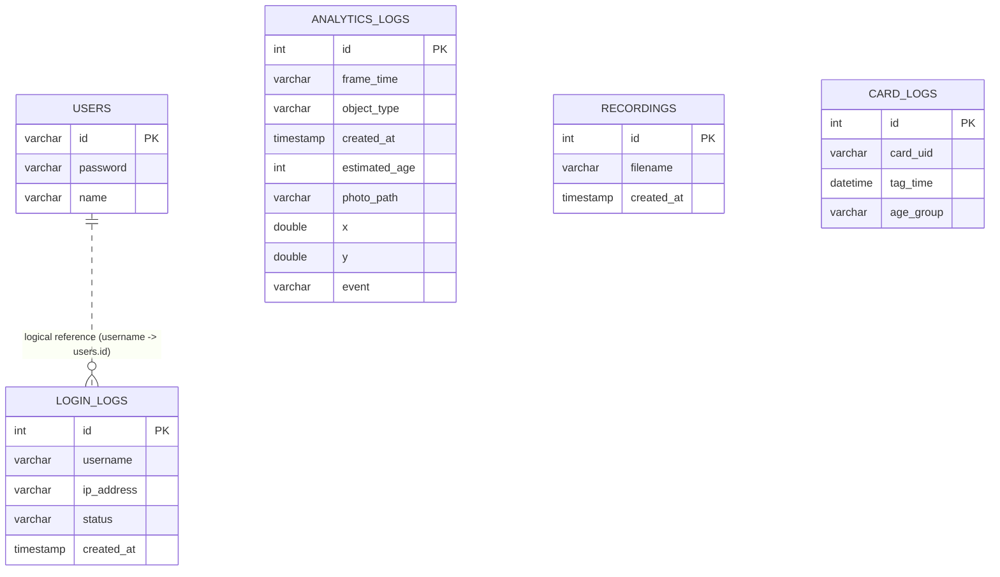

# SFEPS DB Flow (Table-Centric)

Generated on 2026-03-05.

## 1) ER Diagram

## 2) Table-Centric Access Map (.cpp / function / purpose)

```mermaid
flowchart TB
    subgraph U["USERS"]
        U_T[(users)]
        U_F1["auth.cpp::Authenticator::connect()<br/>기능: 인증용 DB 연결/쿼리 준비"]
        U_F2["auth.cpp::Authenticator::authenticate(id, pw)<br/>기능: users에서 계정 일치 여부 조회(로그인 인증)"]
        U_F1 --> U_F2 -->|SELECT users| U_T
    end

    subgraph L["LOGIN_LOGS"]
        L_T[(login_logs)]
        L_F1["main.cpp::evaluate_auth(...)<br/>기능: 인증 결과 생성"]
        L_F2["log.cpp::DBLogger::enqueueLogin(username, ip, success)<br/>기능: 로그인 결과를 큐에 적재"]
        L_F3["log.cpp::DBLogger::processQueue()<br/>기능: login_logs INSERT 실행"]
        L_F4["main.cpp::t_db_cleanup + log.cpp::requestDbCleanup()/processQueue()<br/>기능: 1일 지난 login_logs 정리"]
        L_F1 --> L_F2 --> L_F3 -->|INSERT login_logs| L_T
        L_F4 -->|DELETE old login_logs| L_T
    end

    subgraph A["ANALYTICS_LOGS"]
        A_T[(analytics_logs)]
        A_F1["recorder.cpp::RTSPRecorder::connect_and_record()<br/>기능: 메타데이터를 analytics 파이프라인으로 전달"]
        A_F2["analytics.cpp::AnalyticsProcessor::publishRaw(raw)<br/>기능: XML 메타데이터 파싱/큐 적재"]
        A_F3["analytics.cpp::AnalyticsProcessor::workerLoop()/processLine()<br/>기능: 이벤트 라인 처리"]
        A_F4["analytics.cpp::AnalyticsProcessor::insertAnalyticsRow(...)<br/>기능: analytics_logs INSERT 실행"]
        A_F6["main.cpp::t_db_cleanup + log.cpp::requestDbCleanup()/processQueue()<br/>기능: 1일 지난 analytics_logs 정리"]
        A_F1 --> A_F2 --> A_F3 --> A_F4 -->|INSERT analytics_logs| A_T
        A_F6 -->|DELETE old analytics_logs| A_T
    end

    subgraph R["RECORDINGS"]
        R_T[(recordings)]
        R_F1["recorder.cpp::RTSPRecorder::close_current_file()<br/>기능: 녹화 종료 파일명을 DB logger로 전달"]
        R_F2["log.cpp::DBLogger::enqueueRecording(filename)<br/>기능: 녹화 파일 로그를 큐에 적재"]
        R_F3["log.cpp::DBLogger::processQueue()<br/>기능: recordings INSERT 실행"]
        R_F4["main.cpp::t_db_cleanup + log.cpp::requestDbCleanup()/processQueue()<br/>기능: 1일 지난 recordings 정리(created_at, filename fallback)"]
        R_F1 --> R_F2 --> R_F3 -->|INSERT recordings| R_T
        R_F4 -->|DELETE old recordings| R_T
    end

    subgraph C["CARD_LOGS"]
        C_T[(card_logs)]
        C_F1["rfid_monitor.cpp::RfidMonitor::save_to_db(uid, age_group, time)<br/>기능: RFID 읽기 이벤트 처리(EventMatcher 전달)"]
        C_F1 -. "현재 card_logs SQL INSERT/SELECT 미구현" .-> C_T
    end
```

Notes:
- 물리 FK는 없고 `login_logs.username -> users.id`는 논리 참조입니다.
- `card_logs`는 스키마는 있지만 현재 코드에서 SQL로 접근하지 않습니다.
