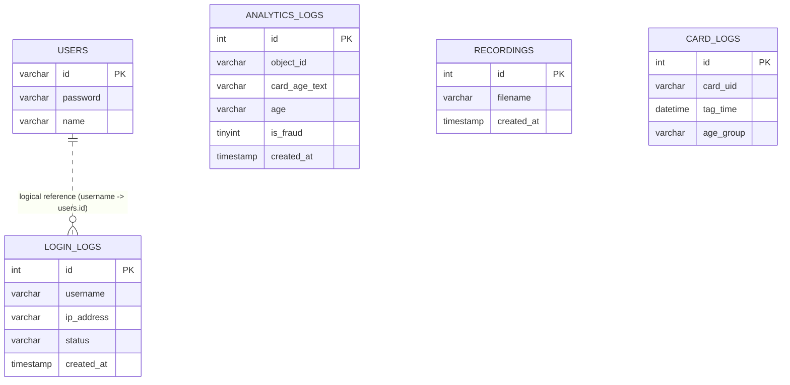
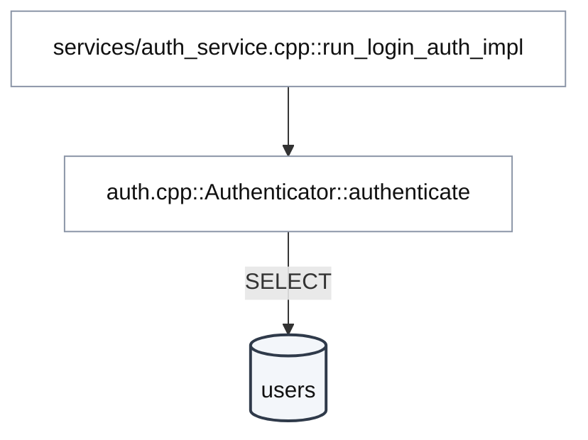
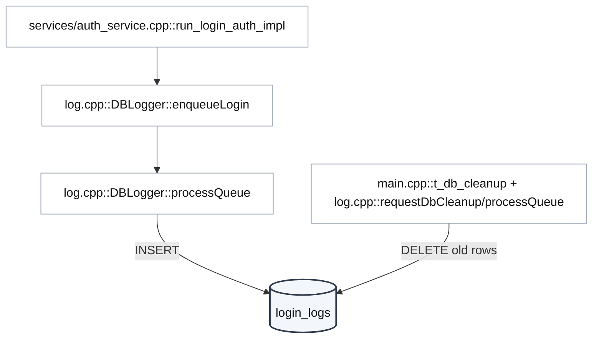
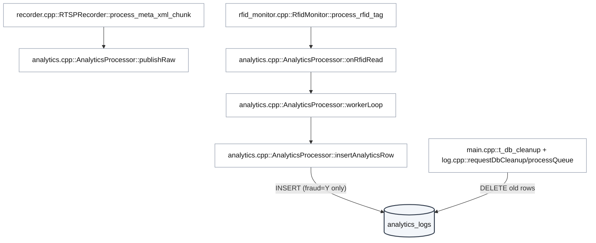
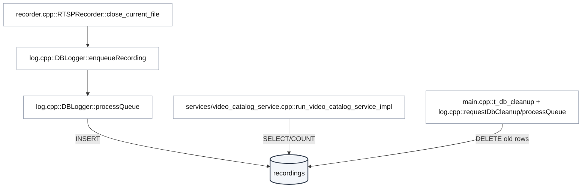
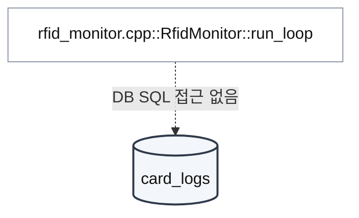

# SFEPS DB Flow (Table-Centric)

Generated on 2026-03-19.

## 1) ER Diagram (Runtime-Used Columns)

## 2) Table-Centric Access Map (One Mermaid Per Table)

### 2-1) USERS

### 2-2) LOGIN_LOGS

### 2-3) ANALYTICS_LOGS

### 2-4) RECORDINGS

### 2-5) CARD_LOGS

Notes:
- DB는 런타임에서 `SFEPS_DB_NAME_ANALYTICS` 단일 스키마를 사용합니다.
- 물리 FK는 없고 `login_logs.username -> users.id`는 논리 참조입니다.
- `analytics_logs`는 현재 `object_id/card_age_text/age/is_fraud/created_at` 중심으로 기록합니다.
- `card_logs`는 코드에서 SQL INSERT/SELECT를 수행하지 않습니다.
