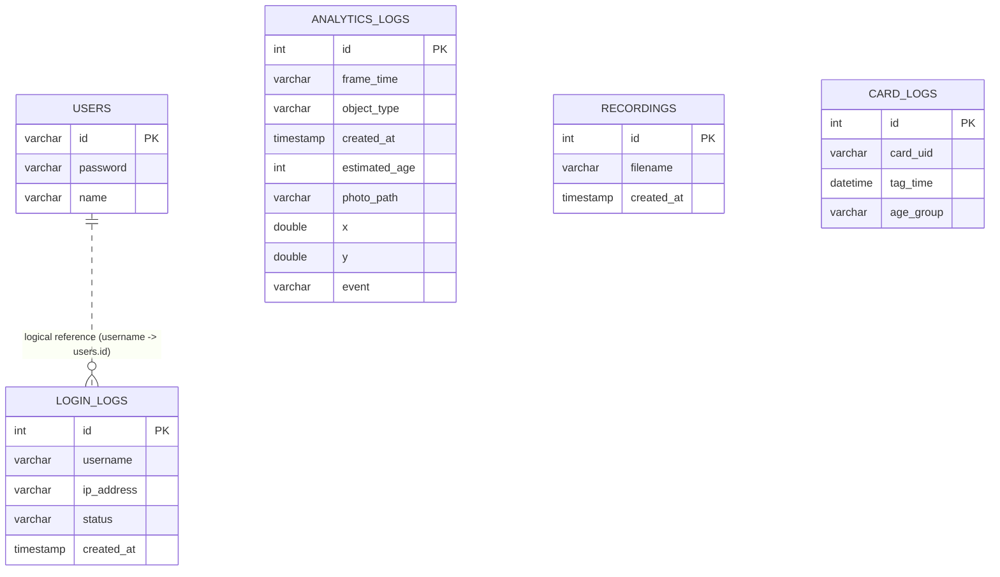
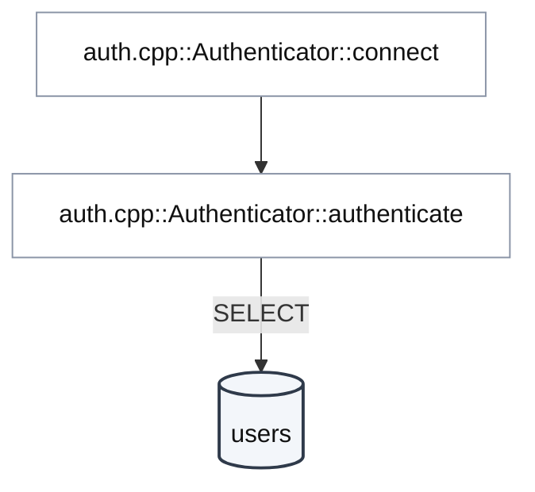
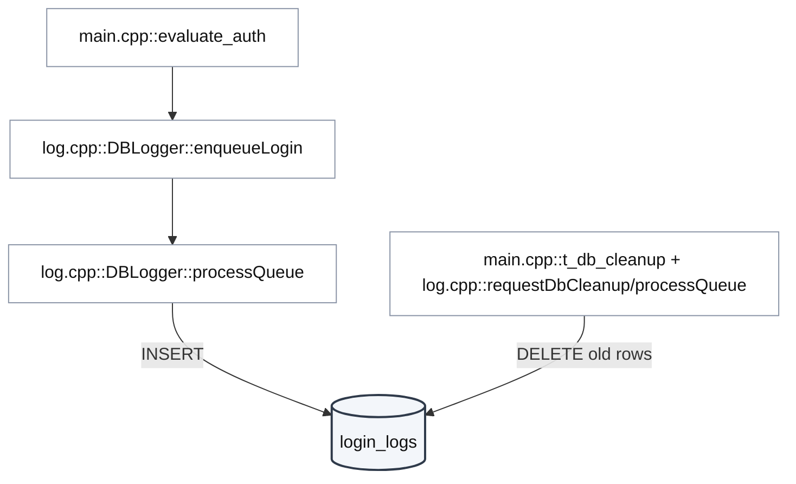
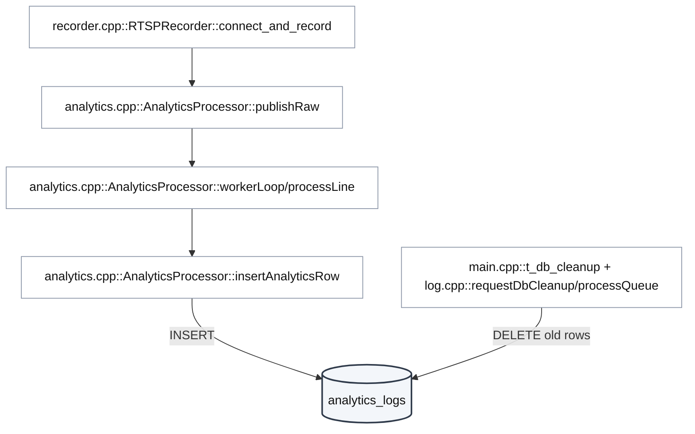
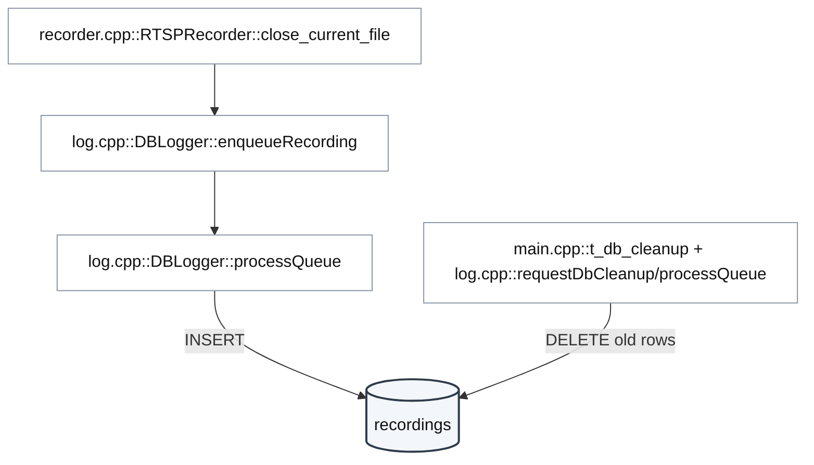
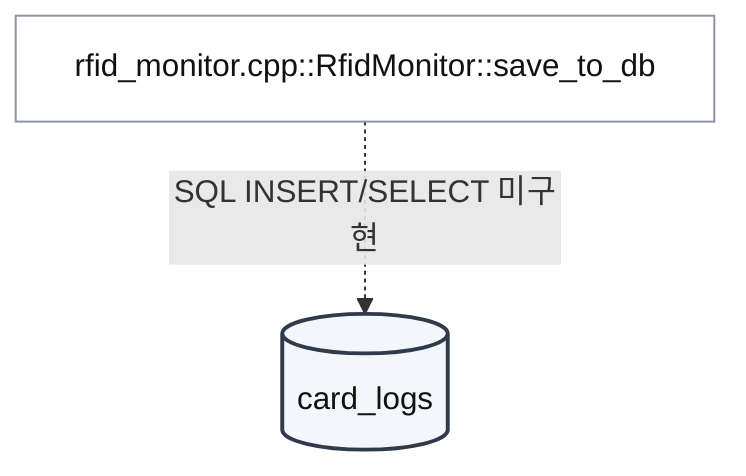

# SFEPS DB Flow (Table-Centric)

Generated on 2026-03-05.

## 1) ER Diagram

## 2) Table-Centric Access Map (One Mermaid Per Table)

### 2-1) USERS

### 2-2) LOGIN_LOGS

### 2-3) ANALYTICS_LOGS

### 2-4) RECORDINGS

### 2-5) CARD_LOGS

Notes:
- 물리 FK는 없고 `login_logs.username -> users.id`는 논리 참조입니다.
- `card_logs`는 스키마는 있지만 현재 코드에서 SQL로 접근하지 않습니다.
