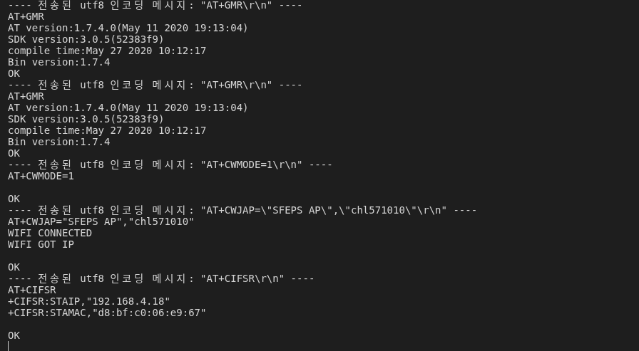

## ESP8266 AT 펌웨어 및 라즈베리파이 AP 연동 체크

### 1. ESP8266에 AT 펌웨어가 올라와 있는지 확인

#### 1-1. 배선 (PC ↔ ESP8266)

- **ESP8266 TX** → **PC RX** (USB-시리얼 어댑터 또는 Nucleo의 ST-LINK VCP RX)
- **ESP8266 RX** → **PC TX**
- **GND** 공통

#### 1-2. 시리얼 터미널 설정

- 포트: `/dev/ttyUSB0`, `/dev/ttyACM0` 등 실제 장치
- 속도(보레이트): 우선 **115200 8N1**
  - 동작 안 하면 **9600**, **74880** 등도 시도

#### 1-3. AT 명령으로 펌웨어 확인

터미널에서 아래를 입력:

```text
AT\r\n
```

- **정상 (AT 펌웨어 있음)**:
  - `AT` → `OK`
  - `AT+GMR` → AT 버전 정보 출력
    - 예: `AT version:1.7.4.0(...)` 등
- **비정상 (AT 펌웨어 없거나 깨짐)**:
  - 아무 응답 없음
  - 엉뚱한 문자만 출력
  - 여러 보레이트로 재시도해도 `OK`가 안 나오면
    → AT 펌웨어 플래시 필요 (esptool.py 등으로 별도 작업)

> **정리**: `AT` 명령에 **`OK`**가 돌아오면 AT 펌웨어가 올라가 있다고 보면 됨.

---

### 2. 라즈베리파이가 AP 모드일 때의 통신 구조

최종 그림은 **라즈베리파이가 AP + TCP 서버**, ESP8266+STM32는 **WiFi 클라이언트 + UART 브릿지**:

1. **라즈베리파이**:
   - AP SSID: `SFEPS_AP`
   - PW: `chl571010`
   - AP IP: 예) `192.168.4.1`
   - TCP 서버: `192.168.4.1:5555` (이미 동작 중이라고 가정)
2. **ESP8266**:
   - Station(STA) 모드로 **라즈베리파이 AP(SFEPS_AP)** 에 접속
   - TCP 클라이언트로 `192.168.4.1:5555` 에 접속
   - TCP로 받은/보낸 데이터를 UART로 그대로 흘려보내는 역할
3. **STM32 (Nucleo-F401RE)**:
   - USART1 (PA9 TX, PA10 RX) 로 ESP8266과 UART 연결
   - UART로 들어온 문자열을 파싱해서 서보 제어(모터/LED 등)를 수행

즉 **WiFi ↔ ESP8266 ↔ UART ↔ STM32** 구조에서,  
라즈베리파이가 AP/서버 역할, ESP8266+STM32는 클라이언트/장치 역할을 한다.

---

### 3. ESP8266을 라즈베리파이 AP에 붙이는 AT 명령 절차

전제: 1번 단계에서 AT 펌웨어가 정상(`AT` → `OK`) 이라고 가정.

#### 3-1. Station 모드로 변경

```text
AT+CWMODE=1
```

- `1` = STA (클라이언트)
- `2` = AP
- `3` = STA+AP

정상 응답:

```text
OK
```

#### 3-2. 라즈베리파이 AP에 접속

```text
AT+CWJAP="SFEPS_AP","chl571010"
```

성공 시 수 초 후:

```text
WIFI CONNECTED
WIFI GOT IP
OK
```

#### 3-3. IP 확인 (옵션)

```text
AT+CIFSR
```

- 출력 중 `STAIP,"192.168.4.x"` 형태의 IP가 나오면 라즈베리파이 AP에 제대로 붙은 상태.

 
---

### 4. 라즈베리파이 TCP 서버(192.168.4.1:5555)에 ESP8266이 붙도록 설정

라즈베리파이 쪽에서 **이미 TCP 서버(포트 5555)** 를 띄워 놓았다고 가정.

#### 4-1. 단일 연결 모드 & 일반 모드 설정

```text
AT+CIPMUX=0
AT+CIPMODE=0
```

- `CIPMUX=0`: 단일 연결
- `CIPMODE=0`: 일반 모드 (필요하면 나중에 투명 모드로 변경 가능)

#### 4-2. TCP 서버(라즈베리파이)에 접속

```text
AT+CIPSTART="TCP","192.168.4.1",5555
```

성공 시:

```text
CONNECT
OK
```

이제 **ESP8266 ↔ 라즈베리파이(192.168.4.1:5555)** 사이에 TCP 연결이 열린 상태.

#### 4-3. 데이터 보내기 예 (테스트)

```text
AT+CIPSEND=12
1500 1500\r\n
```

- `AT+CIPSEND=12` : 이후 **12바이트**를 보낸다는 의미
  - `"1500 1500\r\n"` 은 12바이트(공백/CRLF 포함) 예시
- 라즈베리파이 서버에서는 이 문자열을 그대로 수신
- 동시에 ESP8266 UART TX → STM32 USART1 RX(PA10) 로도 동일 데이터가 전달
- STM32 펌웨어(현재 프로젝트)는 **USART1(WiFi)** 로 들어오는 문자열을 파싱해서
  서보 제어(각도/모드 변경)를 수행하도록 구현되어 있음.

---

### 5. 실제 운용 시 추천 플로우

#### 5-1. 초기 설정 (한 번만)

PC ↔ ESP8266 시리얼을 사용해서:

1. AT 펌웨어 확인:

   ```text
   AT
   → OK
   ```

2. Station 모드로:

   ```text
   AT+CWMODE=1
   ```

3. 라즈베리파이 AP에 접속:

   ```text
   AT+CWJAP="SFEPS_AP","chl571010"
   ```

ESP8266은 플래시에 AP 정보가 저장되므로,  
이후 재부팅해도 **자동으로 `SFEPS_AP`에 접속**하는 것이 일반적이다.

#### 5-2. 운용 시 (런타임)

1. **라즈베리파이**:
   - AP (`SFEPS_AP`, `chl571010`) + TCP 서버(포트 5555) 실행
2. **ESP8266+STM32**:
   - ESP8266 부팅 → 자동으로 `SFEPS_AP` 접속
   - (선택) ESP8266이 부팅한 뒤, STM32에서 AT 명령으로:

     ```text
     AT+CIPMUX=0
     AT+CIPMODE=0
     AT+CIPSTART="TCP","192.168.4.1",5555
     ```

     를 자동으로 날려서 서버에 붙게 할 수도 있음 (펌웨어 로직으로 구현 가능).
3. 연결 후:
   - 라즈베리파이 서버 입장에서는
     - 클라이언트1(ESP8266)와 TCP로 연결된 상태가 됨.
   - 라즈베리는 **ESP8266의 IP(192.168.4.x)** 를 직접 의식할 필요 없이,
     - 서버 소켓에서 읽고 쓰기만 하면 됨.
   - STM32는 **USART1(UART)만 보고**, 들어오는 문자열을 파싱해서 제어 수행.

---
#### 연결 확인

```text
---- 전송된 utf8 인코딩 메시지: "AT+CIPMUX=0\r\n" ----
AT+CIPMUX=0

OK
---- 전송된 utf8 인코딩 메시지: "AT+CIPMODE=0\r\n" ----
AT+CIPMODE=0

OK
---- 전송된 utf8 인코딩 메시지: "AT+CIPSTART=\"TCP\",\"192.168.4.1\",5555\r\n" ----
AT+CIPSTART="TCP","192.168.4.1",5555
CONNECT

OK
---- 전송된 utf8 인코딩 메시지: "AT+CIPSEND=12\r\n" ----
AT+CIPSEND=12

OK
> 
---- 전송된 utf8 인코딩 메시지: "1500 1550\r\n" ----

+IPD,24:CX=0.300000,CY=0.200000

+IPD,3:hi
```
---

### 6. 참고: AT 명령이 `ERROR`만 나오는 경우

터미널 로그 예:

```text
[11:50:44.667] [[ CONNECTED ]]
[SENT] AT
AT

ERROR
```

이 경우 점검 순서:

1. **보레이트 확인**:
   - 115200 → 9600 → 74880 순서로 바꿔가며 테스트
2. **줄 끝(개행) 확인**:
   - `AT\r\n` 이 제대로 나가고 있는지 (터미널 옵션에서 CR/LF 둘 다 추가)
3. **에코 설정 확인**:
   - 에코(입력한 문자를 그대로 다시 표시)가 켜진 상태일 수 있음 (`ATE0`, `ATE1`)
4. **그래도 항상 `ERROR`**:
   - AT 펌웨어가 다른 커맨드셋(커스텀)일 수도 있고,
   - 펌웨어가 깨졌을 수도 있음 → 공식 AT 바이너리로 재플래시 필요.

일반적인 AT 펌웨어에서는 최소한 `AT` → `OK` 가 나와야 정상이다.

